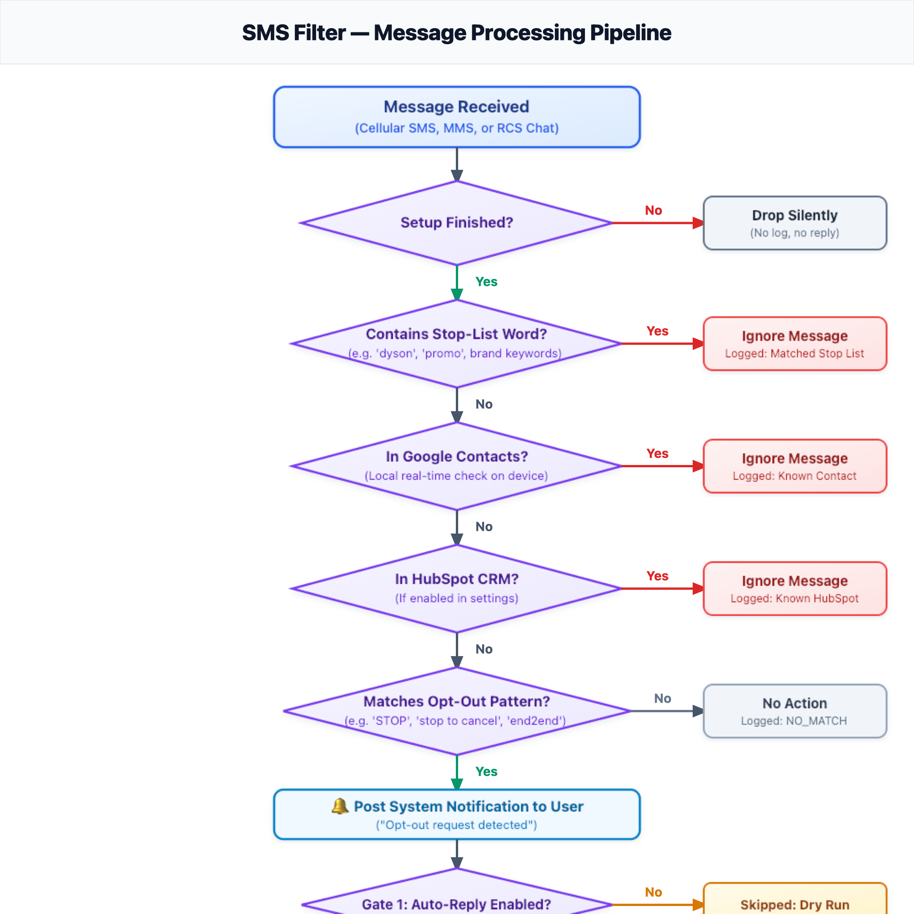
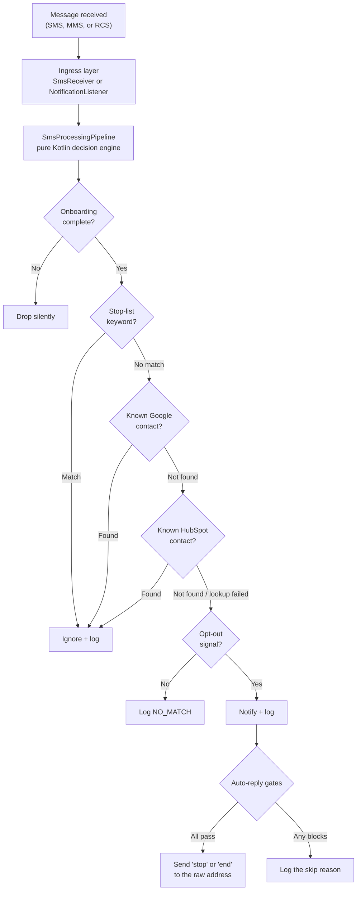

# SMS Filter

An Android app that watches incoming SMS, MMS, and RCS messages for opt-out requests from senders you don't know, and replies on your behalf so they stop texting you — without ever permanently syncing or copying a contact list to disk.

Marketing and automated SMS/RCS messages often carry an opt-out instruction, but acting on every one of them by hand is tedious, and replying to the wrong message is worse than not replying at all. SMS Filter automates the tedious part while being deliberately conservative about the risky part: messages from people in your contacts are never touched, group chats are protected against reply broadcast, and four independent safety gates stand between a detection and an outgoing reply.

**Status:** feature-complete and actively maintained. **215 JVM unit tests** and Room instrumented tests pass. Manual verification against real carrier SMS, MMS, and RCS chats is active.

---

## What it does

An incoming message is evaluated in a fixed order, and the order is load-bearing:



<details>
<summary>View Diagram Definition</summary>



</details>

**Multi-protocol ingress.** The app supports three distinct message types, visible via badges in the Activity Log:
- **`[SMS]`**: Standard cellular SMS reassembled directly from broadcast PDUs (`SmsReceiver`).
- **`[RCS]`**: Rich Communication Services chat messages intercepted in real time via `NotificationListenerService` with inline direct reply capability (`RemoteInput`).
- **`[MMS]`**: Multimedia messages (picture attachments, long multimedia texts, and group threads) classified via `MessagingStyle` and native `android.messages` extras.

**Detection is two-tiered.** A user-defined *stop list* ignores a message outright if it contains any listed keyword — checked first, so an ignored message costs no lookups. Anything surviving that is tested against *opt-out patterns*, each carrying its own match mode: `ANYWHERE` matches as a substring, while `LAST_LINE_EXACT` matches only when the final non-empty line is exactly the pattern word.

**Four gates guard every auto-reply**, and each is defined by something that must *not* happen:

| Gate | Blocks when |
|---|---|
| Master switch | Auto-reply is off — the app detects, notifies, and logs, but never sends |
| Group thread | The message is a group MMS conversation — logs detection but suppresses auto-reply to prevent blasting "STOP" to all participants |
| Repliable sender | The sender is an alphanumeric ID like `VERIZON`, which cannot receive SMS. Cellular messages only — an RCS message carrying a direct-reply handle is answered through the notification, which needs no dialable address |
| 24-hour cooldown | A reply already went to this sender, preventing SMS ping-pong with automated responders |

When a gate blocks a reply, the detection is still logged with the reason and the notification still fires.

---

## Privacy

The app never permanently stores private address books on device. This is a structural property, not a policy:

- **Contact lookups are real-time.** Google Contacts is queried through `ContactsContract.PhoneLookup` on-device; HubSpot is queried over the network per message. No contact list is ever copied or cached to disk.
- **The cooldown table stores only a SHA-256 hash** of the sender address, which recognises a repeat sender but cannot be reversed into a number.
- **`READ_SMS` is deliberately not requested.** The receiver reads cellular broadcast PDUs and notification extras directly, so the app never requests broad read access to your system SMS inbox.
- **The only secret is your HubSpot token**, entered at runtime and held in `EncryptedSharedPreferences`. Nothing is in source, `BuildConfig`, or version control.

---

## Key Features & UI

1. **Activity & Detection Log:**
   - Real-time log cards showing timestamp, message type badge (`[SMS]`, `[RCS]`, `[MMS]`), and status.
   - **Click-to-Message:** Senders are displayed as clickable chips in the card header. Tapping a sender opens the conversation directly in your default messaging app (e.g. Google Messages) using `smsto:` intents.
2. **Interactive Pattern Management:**
   - Tap any pattern in **Settings → Opt-Out Patterns** to open the edit dialog and modify keywords, reply types (`STOP` vs `END`), or match modes (`ANYWHERE` vs `LAST_LINE_EXACT`).
3. **Build Metadata & Versioning:**
   - Displays live build timestamp and a monotonically increasing build sequence number (e.g. `Build: 21 Aug 2026, 12:35:45 PDT (#44)`) at the bottom of the Settings screen.

---

## Architecture

Google's [Guide to App Architecture](https://developer.android.com/topic/architecture) with unidirectional data flow, Hilt for dependency injection, and coroutines throughout.

```
app/src/main/java/com/digiroth/smsfilter/
├── receiver/     SmsReceiver, RcsNotificationListenerService
├── worker/       SmsLookupWorker (thin adapter) + SmsProcessingPipeline (pure Kotlin engine)
├── detection/    OptOutDetector, StopListMatcher, OptOutResult
├── data/
│   ├── db/       Room entities, DAOs, AppDatabase (Schema v4 with migrations)
│   ├── remote/   Retrofit service + Moshi models for HubSpot
│   ├── repository/  ContactRepository, HubSpotRepository, lookup cache
│   ├── settings/ SettingsDataStore — single source for scalar preferences
│   └── security/ SecureTokenStore — EncryptedSharedPreferences
├── platform/     Thin wrappers over SmsManager, RemoteInput direct reply, notifications, ringtones
├── ui/           Compose screens: onboarding, permissions, settings, log
├── util/         Phone normalization, hashing, time, logging, build metadata
└── di/           Hilt modules
```

---

## Building & Sideloading

```bash
./gradlew assembleDebug          # debug APK
./gradlew assembleRelease        # release APK (R8 + code shrinking)
./gradlew installDebug           # install on a connected device
```

### Release Signing
Release signing is supplied via environment variables:
```bash
export SMSFILTER_KEYSTORE_PATH="$HOME/smsfilter-release.jks"
export SMSFILTER_KEYSTORE_PASSWORD="your_password"
export SMSFILTER_KEY_ALIAS="smsfilter"
export SMSFILTER_KEY_PASSWORD="your_password"
```

### Sideloading in the USA (Android 14 / 15)
When sideloading the release APK on physical devices:
1. **Allow Unknown Apps:** Grant installation permission when prompted by Chrome/Files.
2. **Play Protect:** Tap *More details ➔ Install anyway*.
3. **Unblock Notification Listener (Android 13–15 Restricted Settings):** Go to *Settings ➔ Apps ➔ SMS Filter ➔ ⋮ (top-right) ➔ Allow restricted settings*. Then enable SMS Filter in *Notification access*.

---

## Testing

```bash
./gradlew test                   # 215 JVM unit tests
./gradlew connectedAndroidTest   # Room & migration instrumented tests
./gradlew lintDebug              # Android lint verification
```

---

## License

BSD 3-Clause. Copyright (c) 2026 Bill Roth &lt;bill.roth@gmail.com&gt;. Every source file carries the full license header.
