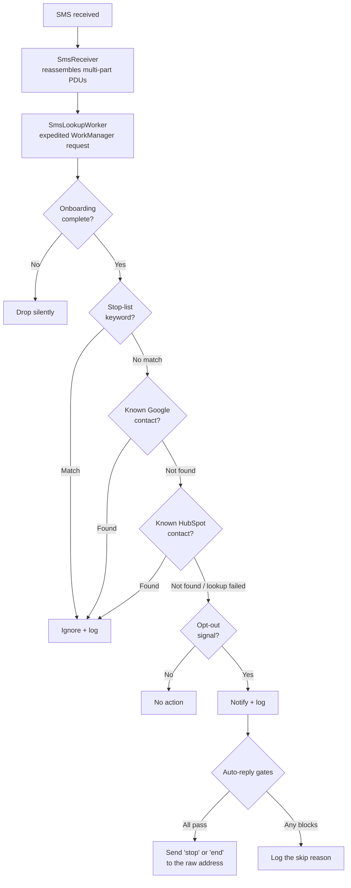

# SMS Filter

An Android app that watches incoming SMS for opt-out requests from senders you don't know, and replies on your behalf so they stop texting you — without ever storing a phone number on the device.

Marketing and automated SMS often carry an opt-out instruction, but acting on every one of them by hand is tedious, and replying to the wrong message is worse than not replying at all. SMS Filter automates the tedious part while being deliberately conservative about the risky part: messages from people in your contacts are never touched, and three independent safety gates stand between a detection and an outgoing reply.

**Status:** feature-complete and building. 153 JVM unit tests and 31 instrumented tests pass. Manual verification against real carrier SMS is in progress — see [TEST_CASES.md](TEST_CASES.md).

---

## What it does

An incoming message is evaluated in a fixed order, and the order is load-bearing:



**Detection is two-tiered.** A user-defined *stop list* ignores a message outright if it contains any listed keyword — checked first, so an ignored message costs no lookups. Anything surviving that is tested against *opt-out patterns*, each carrying its own match mode: `ANYWHERE` matches as a substring, while `LAST_LINE_EXACT` matches only when the final non-empty line is exactly the pattern word. That distinction is the difference between correctly answering a message whose last line is `STOP` and wrongly replying to "reply STOP to unsubscribe" in ordinary marketing copy.

**Three gates guard every auto-reply**, and each is defined by something that must *not* happen:

| Gate | Blocks when |
|---|---|
| Master switch | Auto-reply is off — the app detects, notifies, and logs, but never sends |
| Repliable sender | The sender is an alphanumeric ID like `VERIZON`, which cannot receive SMS |
| 24-hour cooldown | A reply already went to this sender, preventing SMS ping-pong with automated responders |

When a gate blocks a reply, the detection is still logged with the reason and the notification still fires.

## Privacy

The app never stores a phone number. This is a structural property, not a policy:

- **Contact lookups are real-time.** Google Contacts is queried through `ContactsContract.PhoneLookup` on-device; HubSpot is queried over the network per message. No contact list is ever copied or cached to disk.
- **The cooldown table stores only a SHA-256 hash** of the sender address, which recognises a repeat sender but cannot be reversed into a number.
- **Log entries contain no sender address in any form** — the schema has no column for one.
- **`READ_SMS` is deliberately not requested.** The receiver reads sender, body, and timestamp straight from the broadcast PDUs, so the app never gains access to your SMS history.
- **The only secret is your HubSpot token**, entered at runtime and held in `EncryptedSharedPreferences`. Nothing is in source, `BuildConfig`, or version control.

---

## Architecture

Google's [Guide to App Architecture](https://developer.android.com/topic/architecture) with unidirectional data flow, Hilt for dependency injection, and coroutines throughout.

```
app/src/main/java/com/digiroth/smsfilter/
├── receiver/     SmsReceiver — reassembles multi-part messages, enqueues work
├── worker/       SmsLookupWorker (thin adapter) + SmsProcessingPipeline (all decisions)
├── detection/    OptOutDetector, StopListMatcher, OptOutResult
├── data/
│   ├── db/       Room entities, DAOs, AppDatabase
│   ├── remote/   Retrofit service + Moshi models for HubSpot
│   ├── repository/  ContactRepository, HubSpotRepository, lookup cache
│   ├── settings/ SettingsDataStore — every scalar setting and flag
│   └── security/ SecureTokenStore — EncryptedSharedPreferences
├── platform/     Thin wrappers over SmsManager, notifications, ringtones
├── ui/           Compose screens: onboarding, permissions, settings, log
├── util/         Phone normalization, hashing, time, logging
└── di/           Hilt modules
```

### Room holds lists; DataStore holds everything else

Room stores only list-shaped data — the stop list, opt-out patterns, the activity log, and cooldown records. **There is no settings table.** Every scalar setting and flag lives in `DataStore<Preferences>` behind a single injectable wrapper, so the rest of the app reads preferences from exactly one place.

### The decision logic is deliberately separate from Android

`SmsLookupWorker` is a thin adapter: it unpacks input data, delegates to `SmsProcessingPipeline`, and maps the result onto a WorkManager outcome. The pipeline itself contains the entire nine-step decision path and **no `android.*` imports at all**.

This exists because the app sends SMS autonomously, and the three safety gates are all *negative* assertions. You cannot assert "no message was sent" against a static `SmsManager` call. So every side effect — sending, notifying, playing a sound, reading the clock — is reached through a small injected interface:

| Interface | Isolates |
|---|---|
| `SmsSender` | `SmsManager` — makes "no SMS was sent" assertable |
| `DetectionNotifier` | `NotificationManagerCompat` |
| `AlertSoundPlayer` | `RingtoneManager` |
| `E164Formatter` | `PhoneNumberUtils`, a framework stub in JVM tests |
| `TimeProvider` | The system clock, so the 24-hour boundary is exact |
| `AppLogger` | `android.util.Log`, which throws in JVM tests |
| `ContactSource`, `SettingsSnapshotProvider`, `AccessTokenProvider`, `ConnectionStatusWriter` | Classes that need a `Context` |

That last row is the subtle one: a class with no framework imports is still untestable if it depends on something that has them. Each of those four seams was added after exactly that problem surfaced.

The payoff is that all three auto-reply gates, the cooldown boundary in both directions, and the "HubSpot outage still reaches detection" path are covered by fast JVM tests with hand-written recording fakes — no mocking library, no Robolectric.

### Sender classification

Not every sender is a dialable number, and the differences matter:

- **Standard numbers** are normalized to E.164 for lookup, but replies always go to the raw address.
- **Short codes** (5–6 digits) skip E.164 conversion entirely — a short code must receive its reply at the exact address it sent from.
- **Alphanumeric IDs** cannot receive SMS at all. Detection still runs; the reply is skipped and logged.

### HubSpot lookups distinguish failure from absence

The repository returns a three-state result — found, not found, or **lookup failed**. Collapsing failure into "not a contact" would make an outage indistinguishable from an empty CRM. A failure lets the message continue to detection (the safe direction) while still surfacing as a red indicator in Settings. Searches hit HubSpot's normalized `hs_searchable_calculated_phone_number` property with the E.164 form first and the raw digits as a fallback, because contacts entered as "(650) 555-1234" don't match an E.164 query.

---

## Tech stack

Kotlin 2.1.21 · AGP 8.10.1 · Gradle 8.11.1 · min SDK 26, target SDK 35

Jetpack Compose (Material 3) · Hilt · Room · WorkManager · DataStore · Retrofit + OkHttp + Moshi · EncryptedSharedPreferences

All versions are pinned in [`gradle/libs.versions.toml`](gradle/libs.versions.toml) and declared once in the app module. KSP is used for annotation processing throughout; `kapt` is not used.

## Building

```bash
./gradlew assembleDebug          # debug APK
./gradlew assembleRelease        # release APK (R8 + shrinking)
./gradlew installDebug           # install on a connected device
```

Release signing is supplied entirely through environment variables — `SMSFILTER_KEYSTORE_PATH`, `SMSFILTER_KEYSTORE_PASSWORD`, `SMSFILTER_KEY_ALIAS`, `SMSFILTER_KEY_PASSWORD`. When they're unset, the release build falls back to the debug key so it still builds locally.

Full setup instructions, including SDK requirements and connecting a device, are in [build_instructions.md](build_instructions.md).

## Testing

```bash
./gradlew test                   # 153 JVM unit tests
./gradlew connectedAndroidTest   # 31 instrumented tests (needs a device)
```

The JVM suite covers the decision logic end to end: the detection engine, phone-number classification, the full processing pipeline including all three gates, the HubSpot client against `MockWebServer`, and the permission and connection-health state machines. Instrumented tests cover Room and the worker adapter.

Compose UI tests are not present — `ui-test-junit4` is outside the pinned dependency set. The UI is verified by the manual cases in [TEST_CASES.md](TEST_CASES.md).

## Documentation

| Document | Contents |
|---|---|
| [USER_GUIDE.md](USER_GUIDE.md) | How the app behaves for the person using it: setup wizard, detection rules, and settings |
| [Prompt.md](Prompt.md) | The full functional specification the app was built from |
| [architectural_analysis.md](architectural_analysis.md) | Architectural risks, platform constraints, and their resolutions |
| [build_instructions.md](build_instructions.md) | Environment setup and the phased build process |
| [INSTALL_GUIDE.md](INSTALL_GUIDE.md) | Sideloading, Play Protect, and Android behaviours that aren't bugs |
| [TEST_CASES.md](TEST_CASES.md) | 19 manual test cases requiring a physical phone |
| [DEBUG_GUIDE.md](DEBUG_GUIDE.md) | Running and debugging the test suite |
| [walkthrough.md](walkthrough.md) | Design decisions and how they evolved |
| [todo.md](todo.md) | Known deferred items |

## Known limitations

- **Don't force-stop the app.** Android suspends a force-stopped app's broadcast receiver until it's next opened manually. This is platform behaviour, not a bug — see [INSTALL_GUIDE.md](INSTALL_GUIDE.md).
- **Aggressive OEM battery management** on Samsung and Xiaomi can delay background processing until the app is exempted from battery optimisation.
- **`androidx.security:security-crypto` is deprecated** upstream, with `1.1.0-alpha06` its final release. It remains functional on API 26–35 and is retained deliberately for this single-user app.
- **Language switching below API 33** relies on `AppCompatDelegate` with `autoStoreLocales`; the API 26–32 path is compile-checked but has had less real-device exercise than the modern path.

## License

BSD 3-Clause. Copyright (c) 2026 Bill Roth &lt;bill.roth@gmail.com&gt;. Every source file carries the full license header.
