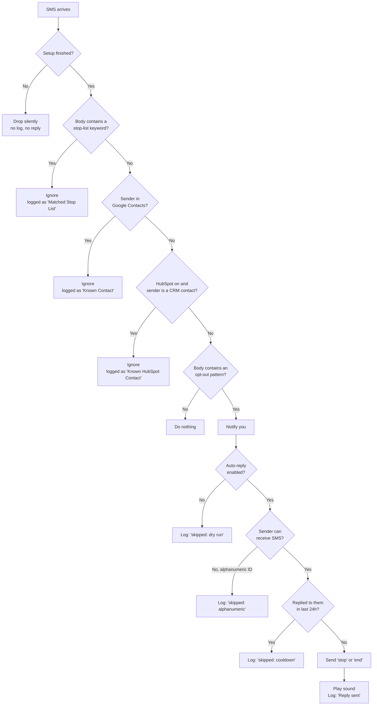

# User Guide

How SMS Filter behaves from the perspective of the person using it. Every statement
here is derived from the implementation rather than from the specification, so this
document describes what the app *does*, not what it was intended to do.

For developer-facing material see [README.md](README.md) and the documents indexed there.

## What the app does

> SMS Filter watches incoming text messages for opt-out requests from senders who are
> **not** in your contacts, and replies automatically so you stop hearing from them.

It is an automatic unsubscriber. When a marketing or spam text arrives from a stranger
and that text contains an opt-out instruction, the app texts back `stop` or `end` on
your behalf. You never have to open the message.

SMS Filter is **not** a replacement messaging app. It never becomes your default SMS
client, never reads your message history — `READ_SMS` is deliberately not requested —
and never hides or deletes anything. Texts still arrive in your normal inbox exactly as
before. SMS Filter works silently alongside it.

## First launch: the setup wizard

A three-step wizard runs once, on first launch.

### Step 1 — Welcome

Explains what the app does, and states the privacy position: your contacts are never
copied or uploaded, and every check happens on the phone in real time.

### Step 2 — Permissions

| Permission | Required | Why |
|---|---|---|
| Receive SMS | Yes | See incoming messages. Without it the app cannot function. |
| Send SMS | Yes | Send the one-word `stop` or `end` reply on your behalf. |
| Notifications | Yes | Tell you when an opt-out has been detected. |
| Read Contacts | No | Recognise people you know so the app never replies to them. |

The wizard cannot be advanced until the three required permissions are granted. Contacts
access is skippable, but skipping it means every sender is treated as unknown, and the
wizard says so.

If a permission is permanently denied, the app detects that Android will no longer show
the system prompt and offers an **Open App Settings** button instead. Permission state is
re-read every time the screen resumes, so returning from system settings updates the
wizard without any further tap.

### Step 3 — Connection test

Counts how many of your contacts have phone numbers and reports the result, for example
`Google Contacts: Accessible (247 contacts found)`.

This step also carries the consent disclosure:

> Auto-reply is ON by default — SMS Filter will automatically send a one-word "stop" or
> "end" reply when it detects an opt-out message from an unknown sender. You can switch
> to detection-only mode anytime in Settings.

Pressing **Done** is the only place in the app that marks setup complete. Until that
moment incoming messages are dropped entirely: no contact lookups, no detection, no
reply, no notification, and no log entry. This matters because the SMS receiver goes live
the instant `RECEIVE_SMS` is granted in step 2, which is before you have consented to
anything being sent on your behalf.

### After the wizard

A one-time "Connect HubSpot CRM?" prompt appears. Dismissing it by any route means it
never appears again. HubSpot is entirely optional and off by default.

## Everyday use

Almost nothing. This is a background utility with no persistent icon, no foreground
service, and no ongoing notification.

The only time it surfaces is a notification reading **Opt-out request detected**, with a
preview of the message text. Tapping it opens the Activity & Detection Log. If sound is
enabled a tone also plays, but only when a reply was actually sent.

## What happens to each incoming message

Checks run in a fixed order, cheapest first, so an ignored message costs no contact
lookups and no network calls.

### The four detection patterns seeded on install

| Pattern | Match mode | Reply sent |
|---|---|---|
| `stop2stop` | Anywhere in the message | `stop` |
| `end2end` | Anywhere in the message | `end` |
| `stop` | Last line, exact match only | `stop` |
| `end` | Last line, exact match only | `end` |

The last-line-exact restriction on bare `stop` and `end` is the most consequential rule in
the detector. Matching `stop` anywhere would fire on ordinary marketing copy such as
"reply STOP to unsubscribe", producing a false positive on nearly every promotional text
ever sent.

Matching is case-insensitive. Trailing blank lines and Unicode space separators such as
the non-breaking space are handled, so a message ending in `"STOP "` still matches.

### The three auto-reply safety gates

1. **Master switch.** Turning Auto-Reply off puts the app in detect-and-notify-only mode.
   This is also the kill switch if a pattern starts misfiring.
2. **Repliable sender.** Alphanumeric sender IDs such as `VERIZON` cannot receive an SMS,
   so no reply is attempted.
3. **Cooldown.** At most one reply per sender per 24 hours. This prevents a reply loop
   where an automated responder's confirmation text itself trips a pattern.

The notification fires *before* these gates, so you are told an opt-out was detected even
when no reply was permitted.

## Settings

Launching the app after setup lands on Settings.

| Section | What it controls |
|---|---|
| Connection Health | Status indicators for Google Contacts and HubSpot, re-checked on every resume so revoking contacts access is reflected rather than leaving a stale result. |
| Auto-Reply | Master on/off, plus a note explaining the 24-hour cooldown. Off means detect and notify only. |
| Stop List | Keywords marking messages the app should never touch. Coarse substring match, so `promo` also matches `promotional`. Over-matching is safe: it only means a message is left alone. |
| Opt-Out Patterns | Add, edit, and remove detection rules. User-added patterns behave identically to the seeded defaults. |
| HubSpot CRM | Optional API token, stored encrypted. When enabled, CRM contacts are also treated as known senders. |
| Sound | On/off and a ringtone picker. Falls back to the system notification sound. |
| Language | English or Spanish. |
| Activity & Detection Log | Opens the log screen. |

## The detection log

A chronological record of every decision, with three event types (detections, ignored
messages, and non-matching messages).

**Ignored** entries name the reason, for example `Ignored: Known Google Contact` or
`Ignored: Matched Stop List word 'promo'`.

**Detection** entries name the pattern that matched and the fate of the reply:
`Reply sent: stop`, `Reply skipped: cooldown`, `Reply skipped: dry run`,
`Reply skipped: alphanumeric sender`, or `Reply skipped: send failed`.

**Not Matched** entries indicate messages received from unknown senders that did not match
any opt-out pattern.

Each log entry displays the timestamp, the sender's phone number or short code (when available),
and a truncated preview of the message body. Tapping the sender chip in any log row immediately
opens that conversation thread in your default messaging app.

Cooldown records continue to store a one-way hash of the sender rather than the number itself.

## Recommended way to start

The app sends real SMS messages on your behalf, and replying `stop` to a spam number
confirms to the sender that your number is live. Verify the detection logic against your
own message mix before letting it send anything.

1. Finish onboarding, then turn Auto-Reply **off** in Settings.
2. Run in detection-only mode for a week. Notifications and log entries still show exactly
   what would have been sent.
3. Review the detection log. For any message you would not want replied to, add a keyword
   to the Stop List or tighten the pattern.
4. Once the log looks right, turn Auto-Reply back on.

## See also

- [INSTALL_GUIDE.md](INSTALL_GUIDE.md) — sideloading, Play Protect, and Android behaviours
  that are not bugs, including why the app must not be force-stopped.
- [TEST_CASES.md](TEST_CASES.md) — manual test cases for exercising these flows on a
  physical phone.
