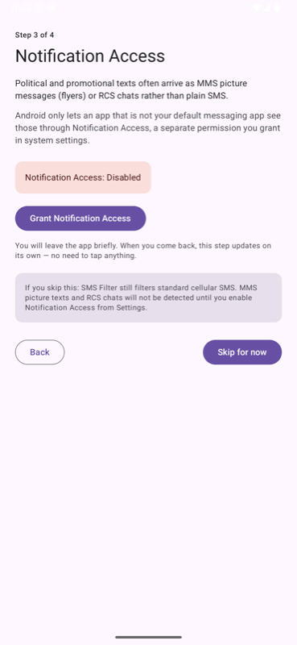
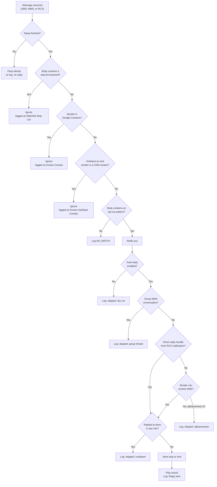
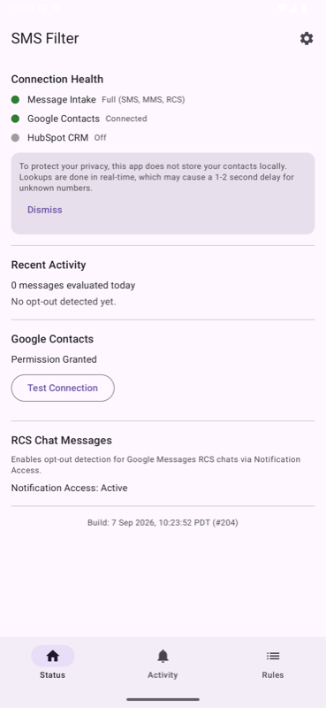
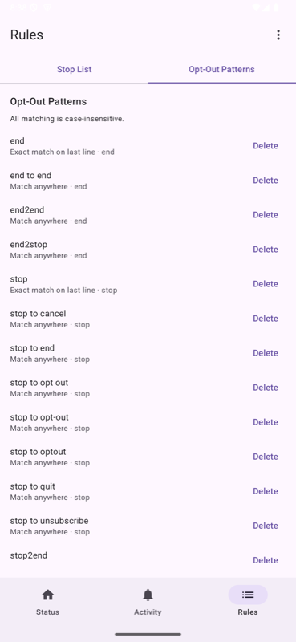
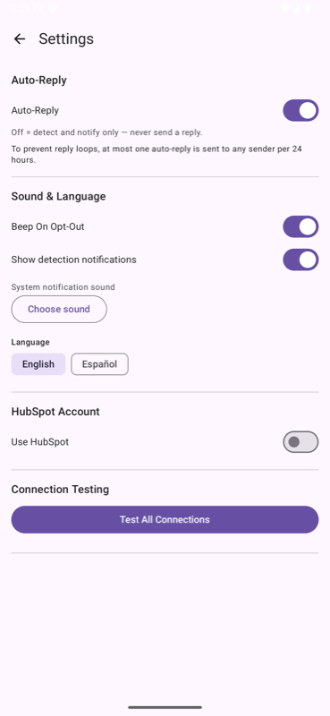

# User Guide

## For Everyday Users

This section explains SMS Filter in plain language. No technical background needed.
If you're comfortable with phone settings and just want the plain facts about what this
app does and how to use it, this is the section for you.

### What This App Does For You

You know the annoying text messages that show up from numbers you don't recognize —
ads for car warranties, "exclusive deals," political spam, or things that just look like
junk? Many of those messages legally have to offer a way to unsubscribe, usually by
replying with the word **STOP**. The problem is, most people never bother to reply,
so the same sender (or the company that sold your number) keeps texting.

SMS Filter watches for those unsubscribe messages and, when it recognizes one, sends the
"STOP" or "END" reply for you automatically — instantly, without you having to open the
message or type anything. Over time this means fewer spam texts, with no extra effort on
your part.

A few important things it will **never** do:

- It will **not** reply to messages from people already in your phone's Contacts. Only
  messages from unknown numbers are ever considered.
- It will **not** become your text messaging app. Your regular Messages app still shows
  every text exactly as it always has. SMS Filter simply works quietly in the background.
- It will **not** read, delete, or hide any of your messages or conversations.

### Is My Information Safe?

Yes. SMS Filter is designed to keep everything on your phone:

- Your contact list is only checked *on your phone* to tell the difference between
  someone you know and a stranger. It is never copied, uploaded, or sent anywhere.
- The app does not have permission to read your message history — it only looks at a
  new text message at the moment it arrives, to decide whether that one message is an
  unsubscribe offer.
- Nothing is shared with advertisers or other companies. The only optional exception is
  if you personally choose to connect a business contacts tool ("HubSpot"), which is off
  by default and meant for small business owners, not typical personal use.

(If you'd like the full technical explanation of these guarantees, see the
[Privacy](README.md#privacy) section of the project's README.)

### Setting It Up (About 5 Minutes)

The first time you open the app, it walks you through a short one-time setup:

1. **A welcome screen** explaining what the app does.
2. **A few permission requests.** Your phone will ask if SMS Filter can "see" text
   messages and "send" text messages. Both need to be allowed, or the app can't do its
   job. It will also ask about your Contacts — allowing this lets the app recognize
   people you already know, which is recommended but not required.
3. **A screen about picture messages and chat-style texts.** Regular green-bubble text
   messages are covered automatically. If you also want the app to catch spam sent as
   picture messages or through chat features (the kind of messages that show up as blue
   bubbles between iPhones and Android "Chat" users), tap the button to turn on
   **Notification Access** and enable SMS Filter in the list that appears. If you'd
   rather skip this, that's fine — you can always turn it on later from the app's main
   screen.
4. **A final summary screen.** This confirms everything is working and reminds you that
   automatic replies are turned on by default. You can switch that off anytime.

Once you tap **Done**, you're finished. There's nothing else to install or configure.

### What You'll Notice Once It's Running

Most of the time, nothing — that's by design. SMS Filter has no icon that sits on your
home screen and no persistent notification nagging you.

The only time you'll hear from it is a notification that says **"Opt-out request
detected"**, letting you know it just replied "STOP" to a spam text on your behalf. You
can tap that notification to see the message it reacted to, or simply ignore it — either
way, it's just a receipt of something already handled.

### Checking How It's Doing

If you'd like to check in on the app, open it and look at the **Status** screen (this is
what opens by default). It shows you, in plain terms:

- Whether it's able to see all your text messages properly (a green checkmark means yes).
- How many messages it has looked at recently.
- The last spam text it caught and stopped.

There's also an **Activity** tab at the bottom of the app that lists every message it has
ever looked at, and what it decided to do about each one — handy if you're curious or
want to double-check its work.

### Changing How It Works

Tap the gear icon (⚙️) at the top of the Status screen to reach **Settings**. The two
settings most people care about:

- **Auto-Reply** — the on/off switch for sending replies automatically. Turn this off if
  you'd rather just be notified about spam without the app replying on your behalf.
- **Sound & Language** — turn the alert sound on or off, and switch the app between
  English and Spanish.

### Frequently Asked Questions

**Will this ever reply to a real person, like a friend or my doctor's office?**
No. It only considers messages from numbers that are not saved in your Contacts, and even
then, it only reacts to messages that specifically look like an unsubscribe offer
(something containing the word "stop" or "end" in a very specific way). Ordinary
conversation is never touched.

**Does replying "STOP" cost me anything?**
No more than any other text message. If your phone plan already includes unlimited texts
(as most modern plans do), there is no added cost.

**What if it makes a mistake?**
You can review everything it has done in the Activity tab. If you ever see something you
disagree with, you can turn off Auto-Reply in Settings at any time — the app will keep
watching and notifying you, it just won't send replies automatically until you turn it
back on.

**Do I need to keep the app open?**
No. Close it like any other app. It continues working in the background whenever a text
message arrives, the same way your phone continues receiving texts and calls when the
Messages app isn't open.

**What if I don't grant the picture-message/chat permission during setup?**
That's fine — ordinary text messages are still fully covered. You can turn that extra
permission on later from the warning banner on the Status screen if you change your mind.

### Need More Detail?

The rest of this guide, starting with "For Technical Users" below, goes into much more
depth about exactly how the app makes its decisions. It's written for a more technical
reader, but you're welcome to explore it — nothing there is off-limits, it's just more
detailed than most people need day to day. For the full engineering-level writeup —
source code layout, architecture diagrams, and build instructions — see the project's
[README](README.md).

---

## For Technical Users

> [!NOTE]
> Everything below this point is the original, detailed reference documentation. It
> assumes familiarity with Android concepts such as permissions, SMS/MMS/RCS transports,
> and app architecture. Everyday users should refer to the [For Everyday
> Users](#for-everyday-users) section above instead.

How SMS Filter behaves from the perspective of the person using it. Every statement
here is derived from the implementation rather than from the specification, so this
document describes what the app *does*, not what it was intended to do.

For developer-facing material see [README.md](README.md) and the documents indexed there.

## What the app does

> SMS Filter watches incoming text messages for opt-out requests from senders who are
> **not** in your contacts, and replies automatically so you stop hearing from them.

It is an automatic unsubscriber. When a marketing or spam text arrives from a stranger
and that text contains an opt-out instruction, the app texts back `stop` or `end` on
your behalf. You never have to open the message.

SMS Filter is **not** a replacement messaging app. It never becomes your default SMS
client, never reads your message history — `READ_SMS` is deliberately not requested —
and never hides or deletes anything. Texts still arrive in your normal inbox exactly as
before. SMS Filter works silently alongside it.

For the underlying code architecture — the ingress layer, the pure-Kotlin decision
engine, and the source layout — see [What it does](README.md#what-it-does) and
[Architecture](README.md#architecture) in the README.

## First launch: the setup wizard

A four-step wizard runs once, on first launch.

### Step 1 — Welcome

Explains what the app does, and states the privacy position: your contacts are never
copied or uploaded, and every check happens on the phone in real time.

### Step 2 — Permissions

The wizard requests the core runtime permissions needed for cellular SMS filtering:

| Permission | Required | Why |
|---|---|---|
| Receive SMS | Yes | See incoming cellular messages. Without it the app cannot function. |
| Send SMS | Yes | Send the one-word `stop` or `end` reply on your behalf. |
| Notifications | Yes | Tell you when an opt-out has been detected. |
| Read Contacts | No | Recognise people you know so the app never replies to them. |

The wizard cannot be advanced until the three required permissions are granted. Contacts
access is skippable, but skipping it means every sender is treated as unknown, and the
wizard says so.

If a permission is permanently denied, the app detects that Android will no longer show
the system prompt and offers an **Open App Settings** button instead. Permission state is
re-read every time the screen resumes, so returning from system settings updates the
wizard without any further tap.

### Step 3 — Notification Access (for MMS & RCS)

Standard Android SMS permissions (`RECEIVE_SMS`, `SEND_SMS`) receive cellular SMS only.
They **do not** receive:
- **MMS messages** (marketing texts with picture attachments, flyers, or images)
- **RCS chat messages** (Rich Communication Services sent via Google Messages or Samsung Messages)

On Android, third-party apps that are not set as the default SMS app cannot receive MMS
broadcasts directly over cellular. Instead, SMS Filter intercepts MMS and RCS messages
when your messaging app posts an incoming notification, and then resolves the full text
from the system MMS store. For that it needs **Notification Access**, a Special App Access
that Android only grants from its own settings screen.

Tapping **Grant Notification Access** opens that screen; enable **SMS Filter** there and
come back. The step re-reads the grant every time it resumes, so it flips to
`Notification Access: Active` on its own — no further tap needed — and the action button
changes from **Skip for now** to **Next**.

The step never blocks. Cellular SMS filtering works without it, so **Skip for now**
continues to the last step, after a note stating the consequence: MMS picture texts and
RCS chats will not be detected until you enable the access from the Status screen later.

### Step 4 — Connection test

Counts how many of your contacts have phone numbers and reports the result, for example
`Google Contacts: Accessible (247 contacts found)`.

An optional **Connect HubSpot CRM?** card lets you paste a Private App access token and
connect during setup. It is skippable in the strong sense: the token is a credential you
very likely do not have to hand on first run, a rejected token shows its error inline
without trapping you on the step, and the wizard finishes either way. Connecting here
switches the integration on and answers the question the one-time Settings prompt would
otherwise ask, so that prompt is suppressed.

This step also carries the consent disclosure:

> Auto-reply is ON by default — SMS Filter will automatically send a one-word "stop" or
> "end" reply when it detects an opt-out message from an unknown sender. You can switch
> to detection-only mode anytime in Settings.

Pressing **Done** is the only place in the app that marks setup complete. Until that
moment incoming messages are dropped entirely: no contact lookups, no detection, no
reply, no notification, and no log entry. This matters because the SMS receiver goes live
the instant `RECEIVE_SMS` is granted in step 2, which is before you have consented to
anything being sent on your behalf.

### After the wizard

**Done** lands on the Status screen. If you granted Notification Access in step 3, the
Message Intake indicator reads `Full (SMS, MMS, RCS)` from the first moment; if you
skipped it, a warning card at the top of Status says so and carries the grant button.

Unless you already connected HubSpot in step 4, a one-time "Connect HubSpot CRM?" prompt
appears the first time you open Settings. Dismissing it by any route means it never
appears again. HubSpot is entirely optional and off by default.

## Everyday use

Almost nothing. This is a background utility with no persistent icon, no foreground
service, and no ongoing notification.

The only time it surfaces is a notification reading **Opt-out request detected**, with a
preview of the message text. Tapping it opens the Activity tab — whether the app was
closed or already running — and pressing Back from there returns to the Status screen
rather than leaving the app. If sound is enabled a tone also plays, but only when a reply
was actually sent.

### Finding your way around

Opening the app lands on **Status**. A bottom navigation bar carries the three
destinations:

| Tab | What it holds |
|---|---|
| **Status** | The health dashboard: message intake, contacts, HubSpot, and recent activity. |
| **Activity** | The detection log — every message evaluated, and what was decided. |
| **Rules** | The Stop List and Opt-Out Patterns editors, as two tabs. |

**Settings** is not on the bar; the gear icon in the Status header opens it, and its back
arrow returns to Status. The bar is absent during first-run setup, so the wizard cannot
be navigated away from before consent is given.

## What happens to each incoming message

Checks run in a fixed order, cheapest first, so an ignored message costs no contact
lookups and no network calls. The README's [What it does](README.md#what-it-does)
section walks through the same decision flow from the code's perspective, naming the
actual classes involved.

View Mermaid Source Code

### The detection patterns seeded on install

| Pattern | Match mode | Reply sent |
|---|---|---|
| `stop to quit` | Anywhere in the message | `stop` |
| `stop to end` | Anywhere in the message | `stop` |
| `stop to opt out` | Anywhere in the message | `stop` |
| `stop to opt-out` | Anywhere in the message | `stop` |
| `stop to cancel` | Anywhere in the message | `stop` |
| `stop to unsubscribe` | Anywhere in the message | `stop` |
| `stop to optout` | Anywhere in the message | `stop` |
| `stop2stop` | Anywhere in the message | `stop` |
| `stop2quit` | Anywhere in the message | `stop` |
| `stop2end` | Anywhere in the message | `stop` |
| `stop=end` | Anywhere in the message | `stop` |
| `end2end` | Anywhere in the message | `end` |
| `end to end` | Anywhere in the message | `end` |
| `end2stop` | Anywhere in the message | `end` |
| `stop` | Last line, exact match only | `stop` |
| `end` | Last line, exact match only | `end` |

The last-line-exact restriction on bare `stop` and `end` is the most consequential rule in
the detector. Matching `stop` anywhere would fire on ordinary marketing copy such as
"reply STOP to unsubscribe", producing a false positive on nearly every promotional text
ever sent.

Matching is case-insensitive. Trailing blank lines and Unicode space separators such as
the non-breaking space are handled, so a message ending in `"STOP "` still matches.

### The auto-reply safety gates

1. **Master switch.** Turning Auto-Reply off puts the app in detect-and-notify-only mode.
   This is also the kill switch if a pattern starts misfiring.
2. **Group conversation protection.** Messages originating from group conversation threads
   (MMS or RCS group chats) are detected and notified, but automated replies are suppressed
   (`Skipped: Group thread`) to avoid broadcasting automated opt-out responses to multiple participants.
3. **Repliable sender.** Alphanumeric sender IDs such as `VERIZON` cannot receive an SMS,
   so no reply is attempted.
4. **Cooldown.** At most one reply per sender per 24 hours. This prevents a reply loop
   where an automated responder's confirmation text itself trips a pattern.

The notification fires *before* these gates, so you are told an opt-out was detected even
when no reply was permitted.

## The Status screen

The app's home. Everything here is a thing you *check* rather than a thing you change:

| Section | What it shows |
|---|---|
| Incomplete Setup Warning | Appears automatically when Notification Access or SMS permissions are missing, warning that MMS and RCS messages will be missed and providing a direct button to enable access. |
| Connection Health | Status indicators for Message Intake (`Full (SMS, MMS, RCS)` vs `SMS only`), Google Contacts, and HubSpot, re-checked on every resume so revoking contacts access or notification access is reflected rather than leaving a stale result. |
| Recent Activity | Messages evaluated since midnight — every event type counts, so the number answers "is the filter seeing traffic at all" — and the most recent detection. Updates live as messages arrive. |
| Google Contacts | Permission state and a **Test Connection** diagnostic reporting how many contacts have phone numbers. |
| RCS Chat Messages | Notification Access grant status and a direct shortcut to system settings to enable it. |

The build stamp (for example `Build: 7 Sep 2026, 10:23:52 PDT (#204)`) sits at the foot.

## The Rules screen

Two tabs, two halves of the same decision — what counts as an opt-out, and what is exempt
from being treated as one:

| Tab | What it controls |
|---|---|
| Stop List | Keywords marking messages the app should never touch. Coarse substring match, so `promo` also matches `promotional`. Over-matching is safe: it only means a message is left alone. |
| Opt-Out Patterns | Add, edit, and remove detection rules. Tapping any pattern row opens an edit dialog allowing you to change its keyword, reply type (`stop` or `end`), and match mode. User-added patterns behave identically to the seeded defaults. |

The Patterns tab's ⋮ menu offers **Reset to Defaults**, behind a confirmation dialog: it
deletes every pattern — including yours — and restores the sixteen the app ships with.

## Settings

Reached from the gear icon on Status. What remains here is the things you *change*:

| Section | What it controls |
|---|---|
| Auto-Reply | Master on/off, plus a note explaining the 24-hour cooldown. Off means detect and notify only. |
| Sound & Language | Beep on/off, a ringtone picker (falls back to the system notification sound), detection notifications on/off, and English or Spanish. |
| HubSpot CRM | Optional API token, stored encrypted. When enabled, CRM contacts are also treated as known senders. |
| Connection Testing | Runs the Google Contacts and HubSpot diagnostics together. |
| About | Tapping the card at the foot of Settings opens a dialog with the app icon, installed version, developer attribution, build timestamp, [license](README.md#license), and buttons to open the full **Documentation** site and the **GitHub Repository**. |

### Incomplete permissions warning

Once setup is complete, SMS Filter actively checks whether all message intake channels can function.
If Notification Access has not been granted, a prominent warning card is displayed at the top of
the Status screen:

> **Warning: You won't receive all messages**
> Notification Access is not granted. SMS Filter can only see standard cellular SMS. MMS messages
> (messages with pictures or flyers) and RCS chat messages will NOT be detected or opted out of
> unless Notification Access is enabled.

Tapping **Grant Notification Access** takes you directly to Android's Notification Access screen
where you can enable SMS Filter with a single toggle. Once enabled, returning to the app immediately
clears the warning and updates the Message Intake indicator to **Full (SMS, MMS, RCS)**. The same
grant is offered during setup as step 3 of the wizard, so this card only appears if it was skipped
there or revoked since.

## Documentation link

The **Status**, **Activity**, and **Rules** screens each carry a small **Documentation** link at
the very bottom, and the About dialog in Settings offers the same link as a full-width button.
All of them open the same place: the [published documentation site](https://wgroth2.github.io/smsfilter/),
built from this guide and the [project's README](README.md), viewable in any browser
without installing the app.

## The Activity tab

A chronological record of every decision, with three event types (detections, ignored
messages, and non-matching messages). It is a bottom-bar destination — there is no back
button on it, and **Clear Log** in the corner empties it.

Filter chips let you view:
- **All**: Displays every evaluated message received by the app, including detections, ignored messages, and unmatched texts.
- **Detections**: Only opt-out detections and the fate of the automated reply.
- **Ignored**: Messages bypassed due to stop list keywords or known contacts.
- **Not Matched**: Messages received from unknown senders that did not match any opt-out pattern.

**Ignored** entries name the reason, for example `Ignored: Known Google Contact` or
`Ignored: Matched Stop List word 'promo'`.

**Detection** entries name the pattern that matched and the fate of the reply:
`Reply sent: stop`, `Reply skipped: cooldown`, `Reply skipped: dry run`,
`Skipped: Group thread`, `Reply skipped: alphanumeric sender`, or `Reply skipped: send failed`.

**Not Matched** entries indicate messages received from unknown senders that did not match
any opt-out pattern.

Each log entry displays the timestamp, a message type indicator badge (`SMS`, `RCS`, or `MMS`)
denoting the transport protocol over which the message arrived, the sender's phone number
or short code (when available), and a truncated preview of the message body. Tapping the sender
chip in any log row immediately opens that conversation thread in your default messaging app.

Cooldown records continue to store a one-way hash of the sender rather than the number itself.

## Recommended way to start

The app sends real SMS messages on your behalf, and replying `stop` to a spam number
confirms to the sender that your number is live. Verify the detection logic against your
own message mix before letting it send anything.

1. Finish onboarding, then turn Auto-Reply **off** (Status → gear → Settings).
2. Run in detection-only mode for a week. Notifications and log entries still show exactly
   what would have been sent.
3. Review the detection log. For any message you would not want replied to, add a keyword
   to the Stop List or tighten the pattern.
4. Once the log looks right, turn Auto-Reply back on.

## See also

- [README.md](README.md) — technical architecture, the detection pipeline
  implementation, source code layout, and build/sideloading instructions for developers.
- [INSTALL_GUIDE.md](INSTALL_GUIDE.md) — sideloading, Play Protect, and Android behaviours
  that are not bugs, including why the app must not be force-stopped.
- [TEST_CASES.md](TEST_CASES.md) — manual test cases for exercising these flows on a
  physical phone.
