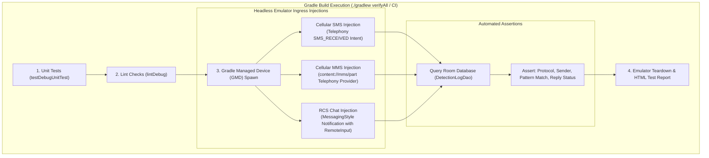

# Headless Automated End-to-End Test Architecture (SMS, MMS, RCS)

This document outlines the architectural blueprint for building an automated, headless end-to-end (E2E) message injection test suite for SMS Filter. This suite automatically injects SMS, MMS, and RCS messages directly on the Android emulator and verifies detection, auto-replies, contact bypassing, and database logging as the final stage of the Gradle build.

---

## 1. Architecture Overview



---

## 2. Ingress Protocol Injection Strategies

### A. Cellular SMS Injection (Testing `SmsReceiver` & `SmsLookupWorker`)
* **Mechanism:** Dispatches a synthetic `android.provider.Telephony.SMS_RECEIVED` broadcast intent containing 3GPP SMS PDU byte arrays.
* **Coverage:**
  - Standard 1:1 SMS multi-part reassembly.
  - Subscription ID resolution across dual-SIM configurations.
  - Expedited WorkManager execution under battery-saver conditions.
* **Injection Code Snippet:**
  ```kotlin
  fun injectSms(context: Context, sender: String, body: String) {
      val intent = Intent(Telephony.Sms.Intents.SMS_RECEIVED_ACTION).apply {
          putExtra("pdus", arrayOf(createSyntheticPdu(sender, body)))
          putExtra("format", "3gpp")
      }
      context.sendBroadcast(intent, Manifest.permission.BROADCAST_SMS)
  }
  ```

---

### B. RCS Chat Injection (Testing `RcsNotificationListenerService` & Direct Reply)
* **Mechanism:** Posts a synthetic `NotificationCompat.MessagingStyle` notification mimicking Google Messages, including `android.messages` bundles and a `RemoteInput` PendingIntent for inline direct replies.
* **Coverage:**
  - Real-time notification interception via `NotificationListenerService`.
  - Multi-bubble chat reconstruction from `android.messages` and `EXTRA_MESSAGES`.
  - Inline `DirectReplySender` registration and auto-reply execution without cellular SMS routing.
* **Injection Code Snippet:**
  ```kotlin
  fun injectRcsNotification(context: Context, senderName: String, senderPhone: String, messageBody: String) {
      val notificationManager = context.getSystemService(NotificationManager::class.java)
      val person = Person.Builder()
          .setName(senderName)
          .setKey("tel:$senderPhone")
          .build()

      val messagingStyle = NotificationCompat.MessagingStyle(person)
          .addMessage(messageBody, System.currentTimeMillis(), person)

      val replyAction = NotificationCompat.Action.Builder(
          android.R.drawable.ic_menu_send,
          "Reply",
          PendingIntent.getBroadcast(context, 0, Intent("TEST_ACTION"), PendingIntent.FLAG_IMMUTABLE)
      ).addRemoteInput(RemoteInput.Builder("key_text_reply").setLabel("Reply").build()).build()

      val notification = NotificationCompat.Builder(context, "test_channel")
          .setSmallIcon(android.R.drawable.sym_action_chat)
          .setStyle(messagingStyle)
          .addAction(replyAction)
          .build()

      notificationManager.notify(101, notification)
  }
  ```

---

### C. Picture MMS & Group MMS Injection (Testing `MmsTextResolver` & Group Guard)
* **Mechanism:** Inserts a synthetic `text/plain` row directly into `content://mms/part` containing a multi-paragraph marketing message ending with `Text STOP to quit`, then posts a thumbnail notification with `Image\n...`.
* **Coverage:**
  - Telephony MMS provider fallback when Google Messages truncates image attachment captions.
  - Group MMS auto-reply suppression (`isGroupConversation = true` ➔ `SKIPPED_GROUP_THREAD`).
* **Injection Code Snippet:**
  ```kotlin
  fun injectMmsTelephonyStorage(context: Context, fullBody: String) {
      val values = ContentValues().apply {
          put("ct", "text/plain")
          put("text", fullBody)
      }
      context.contentResolver.insert(Uri.parse("content://mms/part"), values)
  }
  ```

---

## 3. Automated Assertions

The test harness uses polling assertions with a 2-second timeout against `DetectionLogDao`:

| Test Scenario | Injected Protocol | Expected `messageSource` | Expected `matchedPattern` | Expected `replyStatus` |
|---|---|---|---|---|
| 1:1 Cellular SMS | SMS | `MessageSource.SMS` | `stop2stop` | `Reply sent: stop` |
| 1:1 RCS Chat | RCS | `MessageSource.RCS` | `end2end` | `Reply sent: end` |
| Long Picture MMS | MMS | `MessageSource.MMS` | `stop to quit` | `Reply sent: stop` |
| Group MMS Chat | MMS (Group) | `MessageSource.MMS` | `stop to cancel` | `Skipped: Group thread` |
| Known Contact SMS | SMS | `MessageSource.SMS` | `null` | `Ignored: Known Google Contact` |

---

## 4. Gradle Integration & Headless Automation

### A. Gradle Managed Devices (GMD)
Configure AGP in `app/build.gradle.kts` to manage headless emulator lifecycle:

```kotlin
android {
    testOptions {
        managedDevices {
            devices {
                create<com.android.build.api.dsl.ManagedVirtualDevice>("s24PlusApi35") {
                    device = "Pixel 8 Pro" // 6.7" QHD+ matching S24+ specs
                    apiLevel = 35
                    systemImageSource = "google"
                }
            }
        }
    }
}
```

### B. Single Command Verification (`verifyAll`)
Define a composite task in `app/build.gradle.kts`:

```kotlin
tasks.register("verifyAll") {
    group = "verification"
    description = "Runs unit tests, lint, and headless emulator E2E message injection suite."
    dependsOn("testDebugUnitTest", "lintDebug", "s24PlusApi35DebugAndroidTest")
}
```

### C. Execution Command
To run the full suite from cold start to report generation:
```bash
./gradlew verifyAll
```
* **Phase 1:** Executes all 223 JVM unit tests (~3s).
* **Phase 2:** Runs Android lint checks (~5s).
* **Phase 3:** Starts headless emulator, executes full SMS/MMS/RCS injection suite, verifies SQLite records, generates HTML reports, and tears down the emulator.
