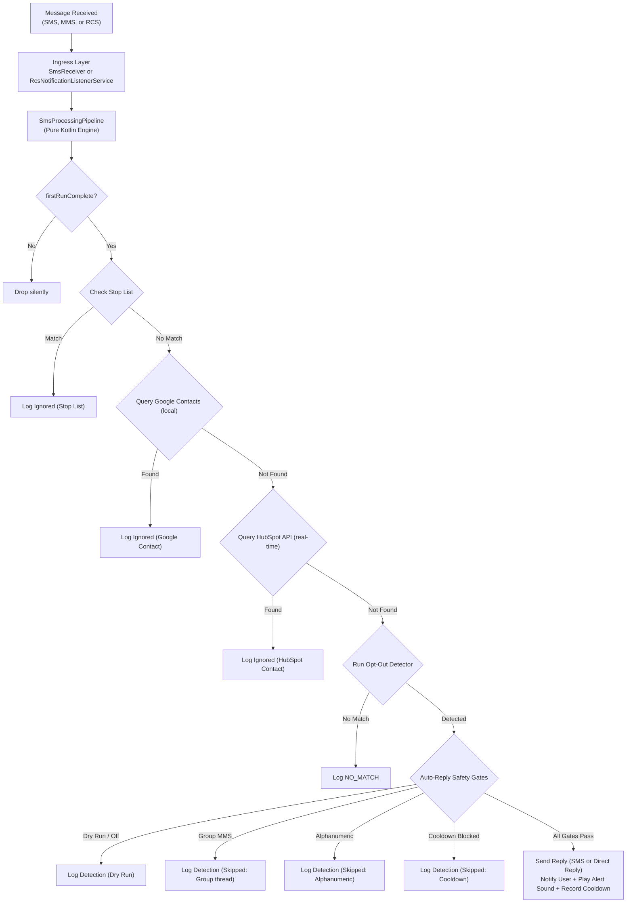

# Walkthrough: Android SMS Compliance Filter Specification & Evolution

This document summarizes the specifications, design decisions, and architectural evolution of the SMS Filter project.

## Architecture & Data Flow

---

## Evolution & Design Journey

### 1. Privacy-First & Offline-First Lookups
* **Google Contacts**: Checked locally via `ContentResolver` on `ContactsContract.PhoneLookup`. Eliminates OAuth or Google Sign-In entirely; requires only standard `READ_CONTACTS`.
* **HubSpot CRM**: Checked in real-time via search API endpoint, bypassing lookups if the HubSpot toggle is turned off.
* **In-Memory Cache**: 15-minute expiration `LruCache` (phone number $\rightarrow$ verification status) minimizes external API calls and network latency for active senders without persisting address books to disk.

### 2. Event-Driven Background Execution (No Persistent Service)
* **Architecture**: Swapped persistent foreground services for a reactive **BroadcastReceiver + Expedited WorkManager** pipeline, keeping background battery drain to zero when idle.
* **Expedited Worker Robustness**: Overrides `getForegroundInfo()` in `SmsLookupWorker` to show a transient status notification on API < 31. Configured WorkManager's `SystemForegroundService` with `android:foregroundServiceType="dataSync"` in the manifest using `tools:node="merge"` to comply with Android 14/15 restrictions.

### 3. Multi-Protocol Messaging Ingress (SMS, RCS, MMS)
* **Cellular SMS Ingress**: Handled by `SmsReceiver`, reassembling multi-part PDUs directly from `android.provider.Telephony.SMS_RECEIVED`.
* **RCS Chat Messages**: Intercepted in real-time via `RcsNotificationListenerService` from supported apps (Google Messages, Samsung Messages). Captures `RemoteInput` PendingIntent handles to execute instant in-thread auto-replies via `AndroidDirectReplySender`.
* **MMS Picture Messages & Group Texts**: Classifies multimedia attachments (`dataMimeType`, `dataUri`, `EXTRA_PICTURE`) and group threads as `MessageSource.MMS`.
* **Un-truncated Multi-Bubble Notification Parsing**: Directly inspects native `android.messages` and `EXTRA_MESSAGES` parcelable bundles from Google Messages to reconstruct full multi-paragraph chat messages without AndroidX person-parsing failures or preview truncation.

### 4. Auto-Reply Safety Controls & Four Gates
Every detected opt-out passes four sequential negative gates:
1. **Master Switch Gate**: Bypasses sending if auto-reply is disabled (detection-only dry run).
2. **Group Thread Protection Gate**: If the message arrives in a group conversation, returns `ReplyDisposition.SKIPPED_GROUP_THREAD` to prevent broadcasting "STOP" to all participants while still notifying and logging.
3. **Repliable Sender Gate**: Skips alphanumeric IDs (e.g. `VERIZON`) that cannot receive SMS.
4. **24-Hour Cooldown Gate**: Stored as SHA-256 hashes (`AutoReplyCooldownEntity`) to prevent reply loops with automated bots.

### 5. Activity Log & Interactive UI
* **Message Source Badges**: Top line of each detection card renders styled badges (`[SMS]`, `[RCS]`, `[MMS]`).
* **Originating Sender Capture & Click-to-Message**: Displays originating phone numbers / short codes on log rows. Senders render as interactive chips; tapping a sender opens the conversation directly in Google Messages via `smsto:` intents.
* **Pattern Editing in Settings**: Tapping any pattern row in **Settings → Opt-Out Patterns** opens an `EditPatternDialog`, allowing inline modification of pattern keywords, reply types (`STOP` vs `END`), and match modes (`ANYWHERE` vs `LAST_LINE_EXACT`).
* **Monotonic Build Sequence Number**: Automatically increments `build_number.properties` on each build and displays the build timestamp and sequence number in the Settings screen (e.g. `Build: 21 Aug 2026, 12:35:45 PDT (#44)`).

### 6. Room Database Migrations
The database schema has evolved with zero data loss through explicit migrations:
* **`v1` ➔ `v2` (`MIGRATION_1_2`)**: Added nullable `sender_address` column to `detection_log`.
* **`v2` ➔ `v3` (`MIGRATION_2_3`)**: Added `message_source` column (`NOT NULL DEFAULT 'SMS'`) to `detection_log`.
* **`v3` ➔ `v4` (`MIGRATION_3_4`)**: Seeded expanded industry default patterns (`stop to cancel`, `stop to opt-out`, `stop to opt out`, `stop to end`, `stop to quit`, `stop=end`) into `opt_out_patterns`.

---

## Test Suite & Verification

* **Unit Tests (JVM)**: **215 tests** covering pattern detection, phone normalization, the 9-step processing pipeline, all 4 auto-reply gates, notification parsing, ViewModel validation, and HubSpot MockWebServer clients.
* **Instrumented Tests (Room)**: Verifies SQLite schema creation, DAO CRUD operations, and migrations `1->2`, `2->3`, and `3->4`.
* **Lint**: Clean across all debug and test configurations.
