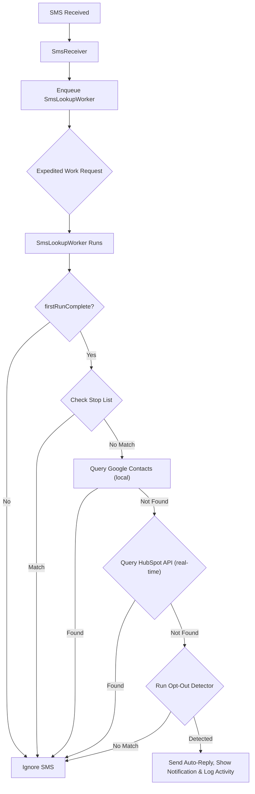

# Walkthrough: Android SMS Compliance Filter Specification

This document summarizes the final specifications, design decisions, and architectural updates made to the [Prompt.md](file:///Users/bill/code/smsfilter/Prompt.md) file. This serves as a memory snapshot of our progress.

## Design Journey & Key Decisions

Over the course of this planning phase, we evolved the app specification to follow modern Android engineering best practices, strict user privacy requirements, and platform constraints:

### 1. Privacy-First & Offline-First Lookups
* **Google Contacts**: Checked locally via `ContentResolver` on `ContactsContract.PhoneLookup`. We completely removed Google Sign-In and OAuth (previously Step 3) to align with privacy best practices. The app relies entirely on local system-synced contacts, requiring only the standard `READ_CONTACTS` permission.
* **HubSpot CRM**: Checked in real-time via search API endpoint, bypassing lookups if the HubSpot toggle is turned off.
* **In-Memory Cache**: Implemented a 15-minute expiration `LruCache` (phone number $\rightarrow$ verification status) to minimize external API requests and network latency for active senders without persisting contact details.

### 2. Event-Driven Background Execution (No Persistent Service)
* **Architecture**: Swapped the persistent foreground service for a reactive **BroadcastReceiver + Expedited WorkManager** pipeline, avoiding foreground service permission restrictions and keeping background battery drain to zero when idle.
* **Expedited Worker Robustness**: Added the requirement to override `getForegroundInfo()` in `SmsLookupWorker` to show a transient system notification. This prevents runtime `IllegalStateException` crashes on older Android versions (API levels < 31) where expedited work fallback runs as a foreground service. Additionally, to comply with Android 14/15 (API 34/35) strict constraints on target SDK 35, the app declares both `FOREGROUND_SERVICE` and the type-specific `FOREGROUND_SERVICE_DATA_SYNC` permissions, and configures WorkManager's `SystemForegroundService` with `android:foregroundServiceType="dataSync"` in the manifest using a `tools:node="merge"` declaration to prevent runtime `SecurityException` crashes.
* **Subsequent Startup Flow**: On subsequent launches, the main Activity displays the **Settings screen** directly. The background SMS pipeline runs independently via `BroadcastReceiver` + `WorkManager` with no UI needed. Notification clicks navigate to the appropriate screen (Detection Log or Settings). `moveTaskToBack(true)` is **not used** — it was removed to prevent users from being locked out of the Settings UI.

### 3. Core Permissions and Auto-Replies
* **SEND_SMS Permission**: Added `android.permission.SEND_SMS` to the manifest and runtime onboarding permission list to enable the automatic replies.
* **Custom Opt-Out Pattern Mapping**: Standardized custom opt-out patterns in the database (`OptOutPatternEntity`) to include both a `replyType` field (`"stop"` or `"end"`) and a `matchMode` field (`ANYWHERE` or `LAST_LINE_EXACT`), each selected in the UI when users add custom rules — the detector honors `matchMode` generically and never special-cases particular pattern strings.
* **Auto-Reply Safety Controls**: Added a master Auto-Reply toggle (off = detection-only dry run), a fixed 24-hour per-sender cooldown stored as SHA-256 hashes (`AutoReplyCooldownEntity`) to prevent SMS reply loops with automated responders, short-code handling (reply to the raw address; normalization via the platform `PhoneNumberUtils.formatNumberToE164`, no external library), and alphanumeric-sender classification (detect and log, never reply). HubSpot lookups match on the normalized `hs_searchable_calculated_phone_number` property rather than exact-match phone filters.
* **SmsManager Retrieval**: Standardized on retrieving `SmsManager` using `context.getSystemService(SmsManager::class.java)` on API 31+, falling back to `SmsManager.getDefault()` on older versions to avoid deprecation warnings.
* **Beep On Opt-Out & Sound Customization**: Added the option to trigger a beep sound (defaulting to the system beep, or utilizing a selected sound file URI) whenever an auto-reply is dispatched.
* **Localization Settings**: Added support for switching app language between English and Spanish via an in-app setting, utilizing externalized string resources.

### 4. Resilient Network & Data Persistence
* **HubSpot Private App Token**: Replaced the browser OAuth flow with a runtime-entered HubSpot Private App access token (scope `crm.objects.contacts.read`), stored in `EncryptedSharedPreferences` under `hubspot_access_token`. This was forced by a platform constraint — HubSpot rejects custom-scheme redirect URLs like `smsfilter://oauth` — and it also eliminates the client ID/secret, token refresh, and the OAuth redirect Activity entirely. HubSpot is now **off by default**, removed from the onboarding wizard (now 3 steps: Welcome → Permissions → Connection Test), and offered exactly once via a cancelable "Connect HubSpot CRM?" dialog the first time Settings appears after onboarding (`hubSpotPromptShown` flag in DataStore). After that, it is managed only from Settings.
* **State Persistence**: Shared connection health statuses (e.g. `CONNECTED`, `DISCONNECTED`, `AUTH_ERROR`) are saved in `DataStore<Preferences>`, allowing both the connection tests and the background `SmsLookupWorker` to update and sync status indicators reactively.
* **HTTP Client Timeout**: Enforced a strict 5-second timeout on HubSpot API calls to prevent the background worker from exceeding its execution quota.
* **Database Migrations**: Configured the Room DB builder with `fallbackToDestructiveMigration(dropAllTables = true)` (the no-arg overload is deprecated in Room 2.7) to simplify early-phase schema alterations.
* **JSON Serialization**: Standardized on **Moshi** (via KSP code generation) for all API requests and response model parsing.

### 5. Distribution, Code Standards & Build Strategy
* **APK Sideloading**: Standardized on private APK distribution for sideloading, including documentation (`INSTALL_GUIDE.md`) to help users bypass Play Protect warnings.
* **Dual Build Modes**: Configured two specific build configurations:
  - **Debug Mode**: Uses default debug keystores, keeps verbose logging active, and bypasses R8/ProGuard optimizations to simplify development testing.
  - **Production/Release Mode**: Uses a production release keystore (loaded securely via environment variables), enables full ProGuard/R8 code shrinking and optimization, and strips out debug logs.
* **Pinned Dependency Version Catalog**: All library dependencies and Gradle plugins are strictly locked in `gradle/libs.versions.toml` to prevent version drift across Kotlin, KSP, Compose BOM, and Hilt.
* **KDoc & Licensing Standards**: Enforced full BSD 3-Clause licensing headers (authored by Bill Roth <bill.roth@gmail.com>) and mandatory KDoc comments across all Kotlin classes, functions, interfaces, and constants via `.agents/AGENTS.md`.
* **7-Phase Incremental Build Strategy**: Development is structured into 7 sequential phases with mandatory verification steps (`assembleDebug` and unit tests) after each phase to guarantee token safety and compile-correct builds:
  1. *Phase 1 — Project Scaffolding & Build Configuration*
  2. *Phase 2 — Room Database, DataStore & Secure Storage (includes `di/DatabaseModule`)*
  3. *Phase 3 — Detection Engine & Utility Layer (Pure unit-testable components)*
  4. *Phase 4 — Background SMS Pipeline (includes `SmsLookupWorker` and `di/RepositoryModule` with placeholder interface binding)*
  5. *Phase 5 — HubSpot API Layer (includes `HubSpotRepositoryImpl` and `di/NetworkModule`)*
  6. *Phase 6 — Onboarding UI & Permissions Screen (`OnboardingScreen`, `PermissionsScreen`, `MainActivity`)*
  7. *Phase 7 — Settings, Detection Log UI & Localization (`SettingsScreen`, `DetectionLogScreen`, English/Spanish `strings.xml`)*

### 6. Pre-Generation Hardening Review (July 2026)

A final workability review of the spec closed these gaps before code generation:

* **Onboarding gate**: `SmsLookupWorker` reads `firstRunComplete` as its very first action and exits silently when `false` — the manifest receiver is live as soon as `RECEIVE_SMS` is granted in wizard Step 2, so without this gate the app could auto-reply mid-wizard. Covered by new manual test case #18.
* **Permanently-denied permission escape hatch**: wizard Step 2 detects permanent denial (`shouldShowRequestPermissionRationale` = `false` after a denial) and offers an "Open App Settings" button instead of a dead request button, re-checking on return.
* **Step 3 failure state**: the Connection Test screen now defines the `READ_CONTACTS`-denied result (*"Google Contacts: Not accessible — permission denied"*) and keeps "Done" enabled, since contacts are non-blocking by design. Step 3 also discloses that auto-reply is ON by default, resolving the tension with dry-run's "trust-building" framing without changing the default.
* **Contacts permission guard**: `ContactRepository` checks `checkSelfPermission(READ_CONTACTS)` before every query and returns "not found" when missing — previously a reachable `SecurityException` crash path, since onboarding permits finishing with contacts denied. Covered by new manual test case #19.
* **HubSpot health-dot "Setup incomplete" state**: a fourth (amber) indicator state for "toggle on, no token saved" — previously undefined, and must never render as red/error.
* **EncryptedSharedPreferences accepted as-is**: `androidx.security:security-crypto` is deprecated with `1.1.0-alpha06` as its final release; the spec now records this as a deliberate choice generators must not "upgrade."
* **INSTALL_GUIDE platform notes**: the guide must explain that force-stopping the app suspends the SMS receiver until next open, and that OEM battery managers can delay processing (with the battery-optimization exception as the fix).

---

## Next Steps for Implementation

When ready to generate the Kotlin codebase, execute the phases sequentially as defined in [Prompt.md](file:///Users/bill/code/smsfilter/Prompt.md):

1. **Run Phase 1**: Create the Gradle wrapper (Android Studio template or `gradle wrapper --gradle-version 8.11.1` — the wrapper JAR is binary and cannot be AI-generated), then scaffold `libs.versions.toml`, `build.gradle.kts`, `AndroidManifest.xml` (including removal of the default WorkManager initializer), and the `@HiltAndroidApp Application` class implementing `Configuration.Provider` with `HiltWorkerFactory`. Verify with `./gradlew assembleDebug`.
2. **Run Phase 2**: Implement Room entities (stop list, opt-out patterns with `matchMode`, detection log, auto-reply cooldown — no settings table), DAOs, `AppDatabase`, the `SettingsDataStore` wrapper (single store for all scalar settings and flags), `EncryptedSharedPreferences`, and `di/DatabaseModule`. Verify with `RoomDatabaseTest`.
3. **Run Phase 3**: Implement `PhoneNumberNormalizer`, `StopListMatcher`, `OptOutDetector`, and `OptOutResult`. Verify with unit tests.
4. **Run Phase 4**: Implement `ContactRepository`, `HubSpotRepository` interface, `SmsReceiver`, `SmsLookupWorker`, and `di/RepositoryModule`. Verify with worker tests.
5. **Run Phase 5**: Implement Moshi models, `HubSpotApiService`, `HubSpotRepositoryImpl`, and `di/NetworkModule`. Verify with `MockWebServer` tests.
6. **Run Phase 6**: Implement `OnboardingViewModel`, `OnboardingScreen.kt`, `PermissionsScreen.kt`, and `MainActivity.kt`. Verify with `./gradlew assembleDebug`.
7. **Run Phase 7**: Implement `SettingsViewModel`, `SettingsScreen.kt`, `DetectionLogViewModel`, `DetectionLogScreen.kt`, English/Spanish `strings.xml`, `TEST_CASES.md`, and `INSTALL_GUIDE.md`. Verify with `./gradlew test assembleRelease`.

