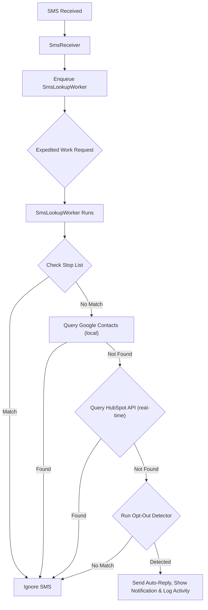

# Walkthrough: Android SMS Compliance Filter Specification

This document summarizes the final specifications, design decisions, and architectural updates made to the [Prompt.md](file:///Users/bill/code/smsfilter/Prompt.md) file. This serves as a memory snapshot of our progress.

## Design Journey & Key Decisions

Over the course of this planning phase, we evolved the app specification to follow modern Android engineering best practices, strict user privacy requirements, and platform constraints:

### 1. Privacy-First & Offline-First Lookups
* **Google Contacts**: Checked locally via `ContentResolver` on `ContactsContract.PhoneLookup`. We completely removed Google Sign-In and OAuth (previously Step 3) to align with privacy best practices. The app relies entirely on local system-synced contacts, requiring only the standard `READ_CONTACTS` permission.
* **HubSpot CRM**: Checked in real-time via search API endpoint, bypassing lookups if the HubSpot toggle is turned off.
* **In-Memory Cache**: Implemented a 15-minute expiration `LruCache` (phone number $\rightarrow$ verification status) to minimize external API requests and network latency for active senders without persisting contact details.

### 2. Event-Driven Background Execution (No Persistent Service)
* **Architecture**: Swapped the persistent foreground service for a reactive **BroadcastReceiver + Expedited WorkManager** pipeline, avoiding foreground service permission restrictions and keeping background battery drain to zero when idle.
* **Expedited Worker Robustness**: Added the requirement to override `getForegroundInfo()` in `SmsLookupWorker` to show a transient system notification. This prevents runtime `IllegalStateException` crashes on older Android versions (API levels < 31) where expedited work fallback runs as a foreground service.
* **Subsequent Startup Flow**: Added a backgrounding strategy where the main Activity automatically moves to the background on subsequent launches (`moveTaskToBack(true)`) to run silently, unless opened from a notification click.

### 3. Core Permissions and Auto-Replies
* **SEND_SMS Permission**: Added `android.permission.SEND_SMS` to the manifest and runtime onboarding permission list to enable the automatic replies.
* **Custom Opt-Out Pattern Mapping**: Standardized custom opt-out patterns in the database (`OptOutPatternEntity`) to include a `replyType` field (`"stop"` or `"end"`), which is selected in the UI when users add custom rules.
* **SmsManager Retrieval**: Standardized on retrieving `SmsManager` using `context.getSystemService(SmsManager::class.java)` on API 31+, falling back to `SmsManager.getDefault()` on older versions to avoid deprecation warnings.
* **Beep On Opt-Out & Sound Customization**: Added the option to trigger a beep sound (defaulting to the system beep, or utilizing a selected sound file URI) whenever an auto-reply is dispatched.
* **Localization Settings**: Added support for switching app language between English and Spanish via an in-app setting, utilizing externalized string resources.

### 4. Resilient Network & Data Persistence
* **HubSpot Credentials Overrides**: Updated onboarding (Step 3) and Settings (HubSpot Account) to let users enter both Client ID and Client Secret overrides, which are written to `EncryptedSharedPreferences`.
* **State Persistence**: Shared connection health statuses (e.g. `CONNECTED`, `DISCONNECTED`, `AUTH_ERROR`) are saved in `DataStore<Preferences>`, allowing both the connection tests and the background `SmsLookupWorker` to update and sync status indicators reactively.
* **HTTP Client Timeout**: Enforced a strict 5-second timeout on HubSpot API calls to prevent the background worker from exceeding its execution quota.
* **Database Migrations**: Configured the Room DB builder with `fallbackToDestructiveMigration()` to simplify early-phase schema alterations.
* **JSON Serialization**: Standardized on **Moshi** (via KSP code generation) for all API requests and response model parsing.

### 5. Distribution & Dual Build Modes
* **APK Sideloading**: Standardized on private APK distribution for sideloading, including documentation (`INSTALL_GUIDE.md`) to help users bypass Play Protect warnings.
* **Dual Build Modes**: Configured two specific build configurations:
  - **Debug Mode**: Uses default debug keystores, keeps verbose logging active, and bypasses R8/ProGuard optimizations to simplify development testing.
  - **Production/Release Mode**: Uses a production release keystore (loaded securely via environment variables), enables full ProGuard/R8 code shrinking and optimization, and strips out debug logs.

---

## Next Steps for Implementation

When resuming this project to generate the Kotlin source code, the next developer/agent should:

1. **Scaffold the Project**: Create a new Android project targeting API 35 with the package name `com.digiroth.smsfilter`.
2. **Setup Dependencies**: Configure the unified Version Catalog (`gradle/libs.versions.toml`) with Hilt, Room, Compose, WorkManager, DataStore, Moshi, CustomTabs, and Jetpack Security.
3. **Implement Application Class**: Create a custom `Application` class to initialize Hilt, configure the Room builder with destructive migrations, and register notification channels ("Opt-out Alerts") on startup.
4. **Implement Data Layer**: Build Room entities/DAOs (with `replyType` in `OptOutPatternEntity`), `DataStore` preferences, `EncryptedSharedPreferences` for credentials, and Retrofit/Moshi HubSpot services.
5. **Implement Repositories**: Create the local Contacts repository (reading `ContactsContract`) and the HubSpot repository (performing Contacts Search API queries with timeouts).
6. **Implement Worker & Receiver**: Implement `SmsReceiver` and `SmsLookupWorker` (incorporating `getForegroundInfo()` and dynamic `SmsManager` SMS replies).
7. **Implement UI & Navigation**: Design the 4-step wizard onboarding flow, startup routing check, subsequent startup auto-backgrounding, and Settings screen with shared connection indicators.
